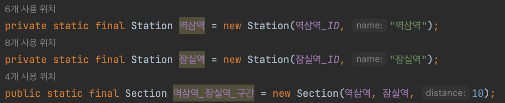
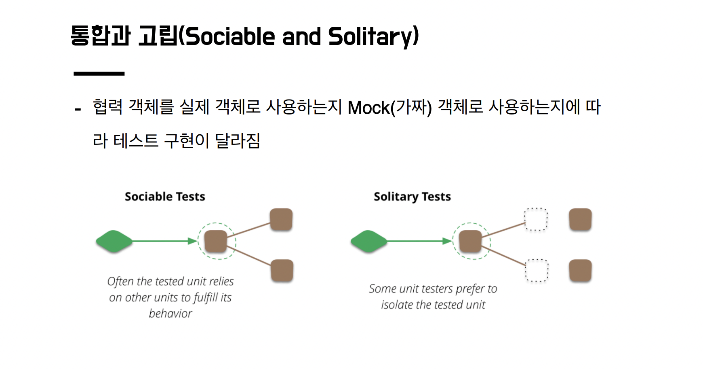
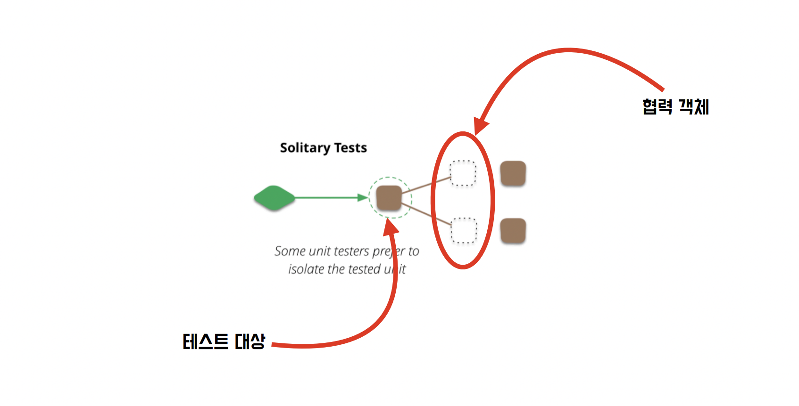

# Unit Test

## Unit Test

### 단위 테스트

- 작은 코드 단위를 검증한다.
- 빠르게 수행 가능하다.
- 격리된 방식으로 처리 가능하다.

단위 테스트는 협력 객체의 유무에 따라 테스트 방법이 달라진다.

**협력 객체가 없는 객체의 테스트**


**협력 객체가 있는 객체의 테스트**



### 통합과 고립

협력 객체를 실제 객체로 사용하는지 가짜 객체로 사용하는지에 따라 테스트 구현이 달라진다.



**통합 단위 테스트(Sociable Unit Test)**

```java
@Test
void test() {
    Station 강남역 = new Station(강남역_ID, "강남역");
    Station 역삼역 = new Station(역삼역_ID, "역삼역");
    Section 강남역_역삼역_구간 = new Section(강남역, 역삼역, 10);

    assertAll(
        () -> assertThat(강남역_역삼역_구간.getUpStation()).isEqualTo(강남역),
        () -> assertThat(강남역_역삼역_구간.getDownStation()).isEqualTo(역삼역)
    );
}
```

**고립 단위 테스트(Solitary Unit Test)**

```java
@Test
void test() {
    Section 강남역_역삼역_구간 = mock(Section.class);
    when(강남역_역삼역_구간.getUpStation()).thenReturn(강남역);
    when(강남역_역삼역_구간.getUpStation()).thenReturn(역삼역);

    assertAll(
        () -> assertThat(강남역_역삼역_구간.getUpStation()).isEqualTo(강남역),
        () -> assertThat(강남역_역삼역_구간.getDownStation()).isEqualTo(역삼역)
    );
}
```

## Test Double

### Test Double이란?

- 실제 객체 대신 사용되는 모든 종류의 객체에 대한 일반 용어
- 즉 실제를 가짜 버전으로 대체한다는 의미이다.
- 테스트 더블을 진행하는 방식에는 `Dummy Object`, `Test Stub`, `Test Spy`, `Mock Object`, `Fake Object`가 있다.



### Test Double을 진행하는 방법

Test Double을 진행하는 방법에는 Mockito 활용하는 방법, MockExtension 활용하는 방법, Spring을 활용한 Stubbing 방법이 있다.

### Test Double을 진행하는 방식

Test Double은 Stub 객체, Fake 객체, Mock 객체를 사용하는 방식이 있다.

## 다시 통합과 고립

### Test Double을 사용할 경우

- 테스트 대상을 검증할 때 외부 요인으로 부터 철저히 격리한다.
- 하지만 테스트가 협력 객체의 상세 구현을 알아야 한다.

### 실제 객체를 사용할 경우

- 실제 객체를 사용할 경우 협력 객체의 상세 구현에 대해서 알 필요가 ㅇ벗다.
- 하지만 협력 객체의 정상 동작 여부에 영향을 받는다.

### **테스트 코드를 작성할 때**

- 가짜 객체를 활용하면 실제 객체를 사용할 때보다 조금 더 편하게 테스트를 작성할 수 있다.
- 하지만 상세 구현에 의존하는 테스트가 될 수 있다.

### 추천하는 방법

- TDD를 연습할 때는 가급적이면 실제 객체를 활용하는 것을 우선으로 진행한다.
- 테스트 작성이 어렵거나 흐름이 잘 이어지지 않는다면 테스트 더블을 활용하는 방법으로 접근하는 것을 추천한다.