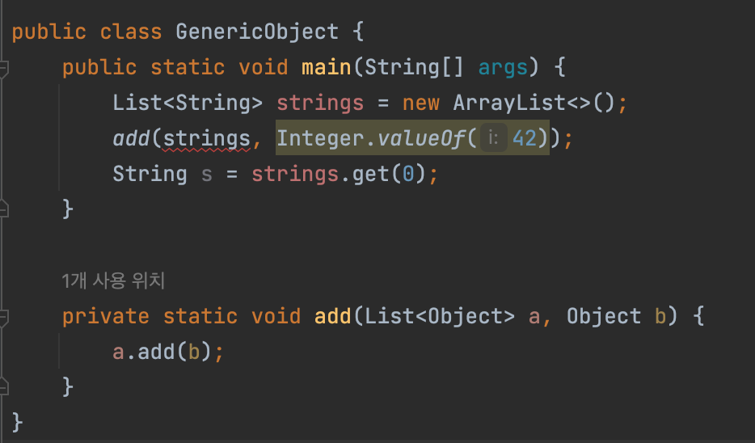
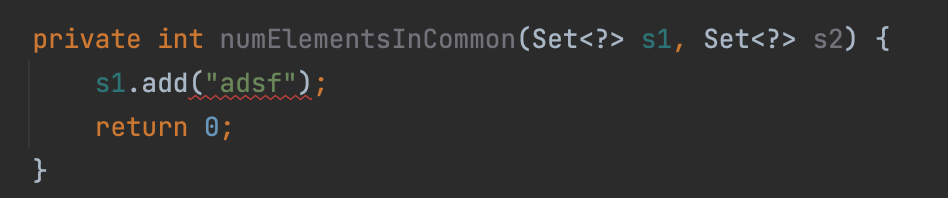

## 로 타입은 사용하지 말라

```ad-note
클래스와 인터페이스 선언에 타입 매개변수가 쓰이면 이를 제네릭 클래스 혹은 제네릭 인터페이스라 부른다. 제네릭 클래스와 제네릭 인터페이스를 통틀어 제네릭 타입이라 부르낟.
```

### 로타입
로 타입은 제네릭 타입에서 타입 매개변수를 전혀 사용하지 않을 때를 말한다. 로 타입은 타입 선언에서 제네릭 타입 정보가 전부 지워진 것처럼 동작하게 된다.

#### 로타입이 존재하는 이유
제네릭을 지원하기 전에는 컬렉션을 로타입으로 선언을 했다.

#### 로 타입을 사용할 때의 문제점
로타입으로 선언된 컬렉션에 다른 타입 원소를 넣게 되면 런타임에서 오류가 발생했다. 런타임에 발생하는 오류의 가장 큰 문제점은 런타임에 문제를 겪는 코드와 원인을 제공하는 코드가 물리적으로 상당히 떨어져 있을 가능성이 커 문제 영역 만큼 많은 코드를 수정해야 한다.

```ad-note
로 타입만 사용할 때에는 주석을 자세하게 작성해서 이런 문제를 해결해 나가야 했지만, 제네릭을 선언함으로 이 정보가 주석이 아닌 타입 선언에서 원소들을 나타낼 수 있었다. (즉, 컴파일 시점에서 문제를 해결할 수 있다.)
```

위와 같은 상황으로 생각해보면 제네릭을 사용하지 않고 로 타입을 사용하게 된다면 안정성과 표현력을 모두 잃게 된다.

### `List` vs `List<Object>`
`List<Object>`  같은 매개 변수화 타입을 사용할 때와 달리 `List`같은 로 타입을 사용하면 타입 안정성을 잃게 된다.

##### 로 타입을 사용하는 경우
```java
private static void add(List a, Object b) {  
    a.add(b);  
}
```

```
item26/GenericObject.java:9: error: incompatible types: List<String> cannot be converted to List<Object>
        add(strings, Integer.valueOf(42));
            ^
Note: Some messages have been simplified; recompile with -Xdiags:verbose to get full output

```

#### 매개 타입을 Object로 사용하는 경우
컴파일 타임에서 문제가 발생해서 쉽게 파악할 수 있다.



#### 코드가 의미하는 것
로 타입이 아닌 매개 변수 타입을 넣은 `List<Object>`는 모든 타입을 허용한다는 의사를 컴파일러에 명확히 전달한 것이다. 매개변수로 List를 받는 메서드에 `List<String>` 타입을 넘길 수 있지만, `List<Object>`를 받는 메서드에는 `List<String>`을 넘길 수 없다. 즉, `List<String>`은 List의 하위 타입이지만, `List<Object>`의 하위 타입은 아니다.

### 비한정적 와일드 카드를 활용해 로 타입을 대신하자
원소만을 반환하는 경우 다형성을 위해 로타입을 사용하고 싶은 경우가 많은 데, 이때는 비한정적 와일드카드를 사용하자

로 타입 컬렉션에는 아무 원소나 넣을 수 있으나 타입 불변식을 훼손해 런타임 오류가 발생하기 쉽다. 반면, `Collection<?>`에는 null외에 어떤 원소도 넣을 수 없기 때문에 값을 추가하려면 컴파일 오류가 발생해 쉽게 문제를 해결할 수 있다.



```ad-note
비한정적 와일드 카드를 사용하면 컬렉션에서 꺼낼 수 있는 개체의 타입도 전혀 알 수 없기 때문에 이런 제약사항을 해결하려면 한정적 와일드 카드를 사용하면 된다.
```

### 그럼에도 로 타입을 사용하는 상황
1. 클래스 리터럴에는 사용한다.
    1. 자바 명세에는 class 리터럴에 매개변수화 타입을 사용하지 못한다. (컴파일시점에서 오류가 발생한다.)
    2. `List<String>`, `List<?>` 등은 허용하지 않는다.
2. instanceof 연산자에서는 사용한다.
    1. 런타임에 제네릭 타입 정보가 지워지므로 instanceof 연산자는 비한정적 와일트카드 타입 외 매개변수화 타입에는 적용할 수 없다. (컴파일에서 오류가 발생한다.)
    2. 비한정적 와일드 카드와 로 타입은 instanceof 에서는 똑같이 동작하기 때문에 지저분하지 않은 로 타입을 사용하자.

#### 자바 코드
```java
public static void main(String[] args) {  
    Set<String> set = new HashSet<>();  
    set.add("string");  
    func(set);  
}  
  
private static void func(Object a) {  
    if (a instanceof Set<?>) {  
        Set<?> strings = (Set<?>) a;  
        System.out.println("instaceof" + Arrays.toString(strings.toArray()));  
        return;    }  
    System.out.println("not instaceof");  
}
```

##### 디컴파일된 코드
```java
public static void main(String[] var0) {  
    HashSet var1 = new HashSet();  
    var1.add("string");  
    func(var1);  
}  
  
private static void func(Object var0) {  
    if (var0 instanceof Set var1) {  
        System.out.println("instaceof" + Arrays.toString(var1.toArray()));  
    } else {  
        System.out.println("not instaceof");  
    }  
}
```

### 핵심 정리
1. 로 타입을 사용하면 런타임에 예외가 발생할 수 있으니 사용하면 안 된다. 로 타입은 제네릭 도입 전 코드와의 호환성을 위해 제공 될 뿐.
2. 로 타입을 사용해야 하는 상황이라면 비한정적 와일드 카드를 사용하거나 Object를 타입 매개 변수로 받는다.
3. 로 타입을 사용해야 하는 경우는 클래스 리터럴, instanceof 연산자와 함께 사용하는 경우다.
