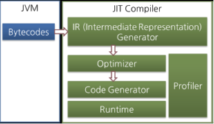

## JIT 컴파일러

> JIT 컴파일러가 컴파일하는 과정은 바이트코드를 하나씩 인터프리팅하는 것보다 오래 걸리므로 한 번만 생행되는 코드라면 컴파일하지 않고 인터프리팅하는 것이 유리하다. JIT 컴파일러를 사용하는 JVM은 내부적으로 해당 메서드가 얼마나 자주 수행되는지 체크하고, 일정 정도를 넘을 때만 컴파일을 수행한다.

### JIT 컴파일러 동작
대부분의 JIT 컴파일러는 다음과 같은 형태로 동작한다.

> IR Generator -> Optimizer -> Code Generator

> JIT 컴파일러는 바이트코드를 중간 단계 표현인 IR로 변환해 치적화를 수행하고 그 다음 네이티브 코드를 생성한다.

### 오라클 JIT컴파일러
오라클 핫스팟 VM은 핫스팟 컴파일러라고 불리는 JIT 컴파일러를 사용한다. 

#### 핫스팟을 컴파일한다.
핫스팟이라 불리는 이유는 내부적으로 프로파일링을 통해 핫스팟(컴파일이 가장 많이 필요한 부분)을 찾아낸 다음 이 핫스팟을 네이티브 코드로 컴파일하기 때문이다.

#### 핫스팟이 아니게 되면 캐시에서 지운다.
핫스팟 VM은 한 번 컴파일된 바이트코드라도 해당 메서드가 더 이상 자주 불리지 않느다면, 캐시에서 네이티브 코드를 덜어내고 다시 인터프리터 모드로 동작한다. 

#### 서버 VM, 클라이언트 VM
핫 스팟 VM은 서버 VM과  클라이언트 VM으로 나뉘어져 있고, 각 다른 JIT 컴파일러를 사용한다. 클라이언트 VM과 서버 VM은 각 오라클 핫스팟 VM을 실행하기 위해 -client, -server 옵션으로 실행한다.

> 서버 VM과 클라이언트 VM 둘 다 동일한 런타임을 사용하지만, 서버 VM에서 사용하는 Advanced Dynamic Optimizing Compiler가 더 복잡하고 다양한 성능 최적화 기법을 사용하고 있다.

###  IBM JVM
IBM JVM은 JIT 컴파일러 뿐만 아니라 IBM JDK 6부터 AOT(Ahead-Of-Time) 컴파일러라는 기능을 도입했다. 이는 한 번 컴파일된 네이티브 코드를 여러 JVM이 공유 캐시를 통해 공유해서 것을 의미한다. 

> 즉, AOT 컴파일러를 통해 이미 컴파일된 코드는 다른 JVM에서도 컴파일하지 않고 사용할 수 있다. 또한AOP 컴파일러를 이용해 JXE(Java EXecutable)이라는 파일 포맷으로 프리컴파일된 코드를 작성해 빠르게 실행하는 방법도 제공하고 있다.

## 결론
자바 성능 개선의 많은 부분은 실행 엔진을 개선하여 이뤄지고 있다. JIT 컴파일러는 물론 다양한 최적화 기법을 도입해 JVM의 성능이 향상되고 있다.