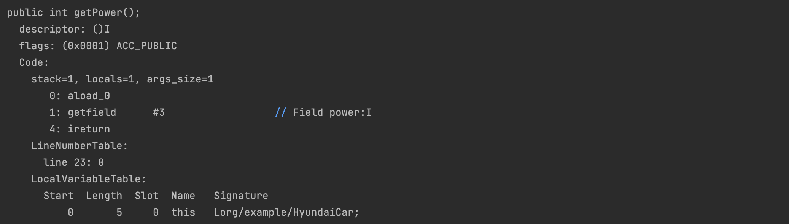

## Java Byte Code

> 자바 소스 코드(확장자가 `.java`이다.)를 자바 컴파일러가 컴파일 하게 되면 자바 바이트코드(확장자가 `.class`이다.)가 생성이 되고, 실행 엔진은 자바 바이트코드를 이용해 애플리케이션을 실행한다.

## 바이트 코드란
Write Once Run Anywhere를 구현하기 위해 JVM은 사용자 언어인 자바와 기계어 사이의 중간 언어인 바이트코드를 사용한다. 이 자바 바이트 코드가 자바 코드를 배포하는 가장 작은 단위이다.

## 바이트 코드 구성
바이트 코드는 크게 세 가지로 볼 수 있다.

1.  Class Format
2.  Constant Pool
3.  Instruction Set

### 바이트 코드 확인하기

```java
public class HyundaiCar {  
    private static final String type = "hyundai";  
    private final String carName;  
    private final int power;  
  
    public HyundaiCar(String carName, int power) {  
        this.carName = carName;  
        this.power = power;  
    }  
  
    public int run(int distance) {  
        System.out.println("run : " + power * distance);  
        return power * distance;  
    }  
  
    public String getCarName() {  
        return type + " : " + carName;  
    }  
  
    public int getPower() {  
        return power;  
    }  
}
```

### Class Format
`Class Format`에는 자바 파일을 클래스 파일로 변환하면서 작성된 정보이다. `version`으로 어떤 jdk에 의해 컴파일 됐는지 파악할 수 있고, `flags`으로 접근 제어자를 알 수 있다. `this_class` 는 자신의 정보를 의미하고 `Constant Pool`인 `#8`에 저장되어 있는다는 것을 파악할 수 있다. 

> `#8`, `#9` 처럼 앞에 `#`이 붙는다면 `Constant Pool`에 저장된다는 의미이다.

마지막 정보에 인터페이스나 필드, 메서드, 그리고 속성 값이 몇 개인지 파악할 수 있다.


### Constant Pool

Constant Pool은 애플리케이션이 실행될 때, 메모리에 미리 적재하는 정보들이다.

> Constant Pool은 Runtime Data Areas에서 Method Area에 속하게 된다.


> 이 곳에는 클래스와 상수, 메서드 그리고 필드에 대한 모든 레퍼런스가 담겨있어서 어떤 메서드나 필드를 참조할 때, JVM은 상수 풀을 통해 메서드나 필드의 실제 메모리상 주소를 찾아 참조한다.

### 내부 필드 선언


### Instruction Set
자바 바이트코드를 컴파일한 결과물인 명령어들을 모은 집합을 의미하고 JVM Instruction Set이라 한다. 자바 바이트코드 명령어는 **1 Byte의 OpCode와 2 Byte의 Operands 로 구성된다.**


> LineNumberTable, LocalVariableTable, Code attribute에 포함된 exception table은 길이가 2바이트로 고정되어 있어서 총 메서드 크기는 65535 바이트 제한이 되어 있다.

#### 생성자 선언


#### 메서드 선언


#### Get 메서드 선언




### 클래스 정보

