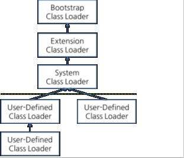
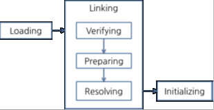
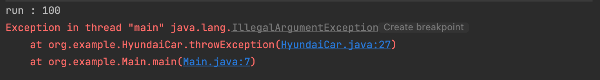
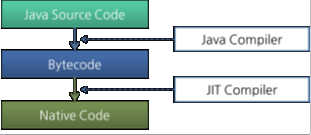

# JVM

## JVM 이란

JVM은 클래스 로더, 런타임 데이터 영역, 실행 엔진으로 구성되어 있다. 클래스 로더가 자바 바이트 코드를 런타임 데이터 영역에 로드하고, JVM 내 런타임 데이터 영역에 배치된 바이트코드는 실행 엔진에 의해 실행된다.

## Class Loader

### Class Loader란

자바는 컴파일 타임이 아니라 런타임에 클래스를 처음 참조할 때 해당 클래스를 로드하고 링크하는 동적 로드 특징이 있다. 이 동적 로드를 담당하는 부분이 JVM의 클래스 로더이다.

> 자바 컴파일러 오류나 네트워크 전송 오류, 파일 복사 과정 중 오류때문에 잘못된 클래스 파일이 생성되는 상황에 대비해 자바 클래스 로더에서 매우 까다로운 검증을 거친다.

### Class Loader 특징

- 계층 구조
	- 클래스 로더끼리 계층 구조로 이루어져 있다. 최상위 계층은 부트 스트랩 클래스 로더이다.
- 위임 모델
	- 계층 구조를 바탕으로 클래스 로더끼리 로드를 위임하는 구조로 동작한다.
		> 클래스를 로드할 때 상위 클래스 로더를 확인해 상위 클래스 로더에 있다면 해당 클래스를 사용하고, 없다면 로드를 요청받은 클래스 로더가 클래스를 로드한다.
- 가시성
	- 하위 클래스 로더는 상위 클래스 로더의 클래스를 찾을 수 있지만, 상위 클래스 로더는 하위 클래스 로더의 클래스를 찾을 수 없다.
- 언로드 불가
	- 클래스 로더는 클래스를 로드할 수 있지만, 언로드할 수 없다. 언로드 대신, 현재 클래스 로더를 삭제하고 새로운 클래스 로더를 생성하는 방법을 사용할 수 있다.

> 각 클래스 로더는 로드된 클래스들을 보관하는 네임스페이스(namespace) 를 갖는다. 클래스를 로드할 때, 이미 로드된 클래스인지 확인하기 위해 네임스페이스에 보관된 FQCN(Fully Qualified Class Name)을 기준으로 클래스를 찾는다. 

> FQCN이 같더라고 네임스페이스가 다르면 다른 클래스이다.즉, 다른 클래스 로더가 로드한 클래스이면 다른 클래스로 간주된다.

### Class Loader 종류



#### 부트 스트랩 클래스 로더

JVM을 기동할 때 생성되고, Object 클래스들을 비록한 자바 API들을 로드한다. 다른 클래스 로더와 달리 자바가 아니라 네이티브 코드로 구현된다.

#### 익스텐션 클래스 로더

기본 자바 API를 제외한 확장 클래스들을 로드한다. 다양한 보안 확장 기능 등을 여기에서 로드한다.

#### 시스템 클래스 로더

부트 스트랩 클래스 로더와 익스텐션 클래스 로더가 JVM 자체 구성 요소들을 구현한다면 시스템 클래스 로더는 애플리케이션의 클래스들을 로드한다고 할 수 있다. 사용자가 지정한 `$CLASSPATH` 내 클래스들을 로드한다.

#### 사용자 정의 클래스 로더

애플리케이션 사용자가 직접 코드 상에 생성해 사용하는 클래스 로더이다.

### Class Loader 동작 순서

클래스 로더가 특정한 클래스 로드를 요청받으면 이전에 로그한 클래스인지 로더 캐시를 확인하고, 상위 클래스 로더를 거슬러 올라가며 확인한다. 그래도 없으면 요청 받은 클래스 로더가 파일 시스템에서 해당 클래스를 찾게 된다.

#### 파일 시스템에서 해당 클래스를 찾는 경우

클래스 로더가 아직 로드되지 않은 클래스를 찾으면 클래스를 로드하고 링크한 다음 초기화한다.



#### Loading

클래스를 파일에서 가져와 JVM 메모리에 로드한다.

#### Verifying

읽은 클래스가 자바 언어 명세 및 JVM 명에세 명시된 대로 잘 구성되어 있는지 검사한다. 클래스 로드의 과정 중 가장 까다로운 검사를 수행하고, 복잡하고 시간이 많이 소요된다.

> JVM TCK의 테스트 케이스 중에서 가장 많은 부분이 잘못된 클래스를 로드하여 정상적으로 검증 오류를 발생시키는지 테스트하는 부분이다.

#### Preparing

클래스가 필요로하는 메모리를 할당하고, 클래스에서 정의된 필드, 메서드, 인터페이스들을 나타내는 데이터 구조를 준비한다.

#### Resolving

클래스의 상수 풀 내 모든 심볼릭 레퍼런스를 다이렉트 레퍼런스로 변환한다.

#### Initializing

클래스 변수들을 적절한 값으로 초기화한다. 즉, static initializer들을 수행하고, static 필드들을 설정된 값으로 초기화한다.

> JVM에서 위와 같은 작업들에 대해 명시하고 있으나 작업에 따라 수행 시점을 유연하게 적용할 수 있다.

## Runtime Data Areas

런타임 데이터 영역은 JVM이라는 프로그램이 운영체제 위에서 실행되면서 할당받는 메모리 영역이다. 스레드 마다 하나씩 생성되는 PC 레지스터(PC Register), JVM 스택(JVM Stack), 네이티브 메서드 스택(Native Method Stack)과 모든 스레드가 공유하는 힙(Heap), 메서드 영역(Method Area), 런타임 상수 풀(Runtime Constant Pool)이 있다.

### Thread 마다 하나씩 생성되는 정보

#### PC Register

PC(Program Counter) 레지스터는 각 스레드마다 하나씩 존재하며 스레드가 시작될 때 생성된다. PC 레지스터는 현재 수행 중인 JVM 명령어 주소를 갖는다.

#### JVM Stack

JVM 스택은 각 스레드마다 하나씩 존재하며 스레드가 시작될 때 생성된다. 스택 프레임(Stack Frame)이라는 구조체를 저장하는 스택으로 JVM은 오직 JVM 스택에 스택 프레임을 추가(Push)하고 제거(Pop)하는 동작만 수행한다.

##### 스택 프레임

JVM 내에서 메서드가 수행될 때마다 하나의 스택 프레임이 생성되어 해당 스레드의 JVM 스택에 추가되고 메서드가 종료되면 스택 프레임이 제거된다. 각 스택 프레임은 지역 변수 배열(Local Variable Array), 피연산자 스택(Operand Stack), 그리고 현재 실행중인 메서드가 속한 클래스의 런타임 상수 풀에 대한 레퍼런스(Reference to Constant Pool)를 갖는다.

> 지역 변수 배열, 피연산자 스택의 크기는 컴파일 시 결정되기 때문에 스택 프레임의 크기도 메서드에 따라 크기가 고정된다.

##### 지역 변수 배열

0부터 시작하는 인덱스를 가진 배열이다. 0은 메서드가 속한 클래스 인스턴스의 this 레퍼런스이고, 1부터는 메서드에 전달된 파라미터들이 저장되며 메서드 파라미터 이후에는 메서드의 지역 변수들이 저장된다.

> 자신 참조가 저장되고 전달되는 파라미터가 저장되며, 이 후 지역 변수가 저장되는 과정은 컴파일 시점에서 자바 바이트 코드가 변환되는 과정과 비슷하다.

##### 피연산자 스택

메서드의 실제 작업 공간이다. 각 메서드는 피연산자 스택과 지역 변수 배열 사이에서 데이터를 교환하고 다른 메서드 호출 결과를 추가하거나 꺼낸다. 

> 피연산자 스택 공간이 얼마나 필요한지는 컴파일 할 때 결정할 수 있으므로, 피연산자의 스택 크기도 컴파일 시에 결정된다.

#### Native Method Stack

자바 외 언어로 작성된 네이티브 코드를 위한 스택이다. 즉 JNI를 통해 호출하는 C와 C++ 등의 코드를 수행하기 위한 스택으로 언어에 맞게 C 스택이나 C++ 스택이 생성된다.

##### 예외 상황에서 JVM Stack

예외 발생시  printStackTrace() 메서드로 보여주는 Stack Trace의 각 라인은 하나의 스택 프레임을 표현한다.

```java
package org.example;  
  
public class HyundaiCar {  
	//...
	
    public void throwException() {  
        throw new IllegalArgumentException();  
    }  
}

public class Main {  
    public static void main(String[] args) {  
        HyundaiCar car = new HyundaiCar("kona", 10);  
        car.run(10);  
        car.throwException();  
    }  
}
```

JVM 스택에서 명령어들을 가져와 호출한 모습을 볼 수 있다.



### Thread 들이 공유하는 정보

#### Heap

인스턴스 또는 객체를 저장하는 공간으로 가비지 컬렉션 대상이다.

> JVM 성능 등의 이슈에서 가장 많이 언급 되는 공간이고 힙 구성 방식이나 가비지 컬렉션 방법 등은 JVM 벤더의 재량이다.

#### Method Area

메서드 영역은 모든 스레드가 공유하는 영역으로 JVM이 시작될 때 생성된다. JVM이 읽어 들인 각 클래스와 인터페이스에 대한 런타임 상수 풀, 필드와 메서드 정보, Static 변수, 메서드의 바이트코드 등을 보관한다.

> 메서드 영역은 JVM 벤더마다 다양한 형태로 구현할 수 있으며 메서드 영역에 대한 가비지 컬렉션은 JVM 벤더의 선택 사항이다.

#### Runtime Constant Pool

클래스 파일 포맷에서 Constant Pool 테이블에 해당하는 영역이다. 메서드 영역에 포함되는 영역이고, JVM에서  가장 핵심적인 역할을 수핸하는 곳이다. 각 클래스와 인터페이스의 상수 뿐만아니 메서드와 필드에 대한 모든 레퍼런스까지 담는 테이블이다.

> 어떤 메서드나 필드를 참조할 때 JVM은 런타임 상수 풀을 통해 해당 메서드나 필드의 실제 메모리상 주소를 찾아 참조하게 된다.

## Execution Engine

클래스 로더를 통해 JVM 내 런타임 데이터 영역에 배치된 바이트 코드는 실행 엔진에 의해 실행된다. 실행 엔진은 자바 바이트 코드를 명령어 단위로 읽어 실행한다.

> 바이트 코드의 각 명령어는 1 바이트 짜리 OpCode와 추가 피연산자로 이루어져 잇고, 실행 엔진은 OpCode를 가져와 피연산자와 함께 작업을 수행한 다음, 다음 OpCode를 수행한다.

그런데 자바 바이트코드는 기계가 바로 수행할 수 있는 언어보다는 비교적 인간이 보기 편한 형태로 구성되어 있어서 실행엔진은 바이트 코드를 JVM 내부 기계가 읽을 수 있도록 형태를 변경하게 된다. 



기계어로 변경하는 두 가지 방식이 있다.

### 자바 바이트 코드를 기계어로 변경한다.

#### 인터프리터

바이트 코드 명령어를 하나씩 읽어서 해석하고 실행한다. 하나씩 해석하고 실행하기 때문에 바이트코드 해석을 빠른 대신 인터프리팅의 결과 실행은 느려서 병목현상이 발생하는 단점이 있다.

> 흔히 말하는 인터프리터 언어의 단점을 그대로 가지는 것이다. 즉, 바이트코드라는 언어는 인터프리터 방식으로 동작한다.

#### JIT 컴파일러

인터프리터의 단점을 보완하기 위해 도입되었다. 인터프리터 방식으로 실행하다 적절한 시점에 바이트코드 전체를 컴파일해 네이티브 코드로 변경하고 이후, 해당 메서드를 더 이상 인터프리팅하지 않고 네이티브 코드로 직접 실행하는 방식이다. 

> 네이티브 코드를 실행하는 것이 인터프리팅하는 것도 빠르고 네이티브 코드는 캐시에 보관하기 때문에 한 번 컴파일된 코드는 빠르게 수행될 수 있다.

#### JIT 컴파일러보다 인터프리터가 좋은 상황

JIT 컴파일러가 컴파일 하는 과정은 바이트코드를 하나씩 인터프리팅한 것보다 느리므로 만약 한 번만 실행되는 코드라면 컴파일하지 않고 인터프리팅하는 것이 훨씬 유리하다. 

> JIT 컴파일러를 사용하는 JVM들은 내부적으로 해당 메서드가 얼마나 자주 수행되는지 체크하고, 일정 정도를 넘을 때에만 컴파일을 수행한다.

