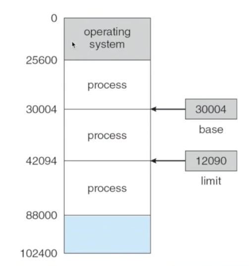

# 메모리 관리

## 목표
---
- 메모리 관리를 위한 메모리 할당 기법과 관리에 대한 이해
- 연속 할당과 분산 할당의 장단점 이해
- 단편화 현상의 원인과 해결 방법
- 페이징 세그먼트 메모리 할당 기법 이해

## 메모리 관리
---
### 메모리 관리와 연관된 OS 역할
> 운영체제는 메모리를 관리하며 프로세스에게 메모리 할당, 해제하는 역할을 한다.

- 메모리가 어디에 누가 사용하는지 추적해야 한다.
- 메모리 공간이 사용 가능하게 될 때, 어떤 프로세스를 어디에 적재할지 결정해야 한다.
- 필요에 따라 메모리를 할당하거나 할당된 메모리를 회수해야 한다.

### 메모리 관리 기법
> OS 영역(운영 체제가 접근할 수 있는 영역)과 사용자 프로세스 영역(일반 프로세스들이 할당되어질 영역)으로 구분

- 반입 정책(적재)
    - 적재할 다음 프로세스의 반입 시기를 결정하는 방법
    - 요구 반입 vs. 예상 반입
    - 요구 반입
        - 요청이 있을 때 메모리에 적재
    - 예상 반입
        - 요청이 있을 프로세스를 예상해서 메모리에 적재
- 배치 정책
    - 반입한 프로세스를 메인 메모리 어디에 저장할 것인가를 결정하는 방법
    - 최초 적합, 최적 적합, 최악 적합
- 대치 정책(교체)
    - 어느 프로세스를 제거할 것인지 결정하는 방법

## 기본적인 메모리 관리
###  배경
주기억장치에서 실행중인 프로세스들이 적재되고 CPU에 의해 빈번하게 접근되어지고, 주기억장치에 명령과 데이터들을 매순간 하나씩 가져오고 저장하는 과정을 시스템 시작에서부터 종료까지 진행하게 된다.
보조 기억장치는 비용이 낮으면서 저장 용량을 높이는 방식을 채택했다면 주 기억장치는 비용이 높아도 빠르게 접근할 수 있다면 시스템의 성능을 높일 수 있는데 초점을 맞추고 있다.

> 지역성의 원리 덕분에 CPU는 주기억장치보다 더 작은 캐시를 3개를 두는 방법 말고도 하드웨어적인 해결 방법이 있다.

### 기본 하드웨어
각 프로세스는 독립된 메모리 공간을 가진다. CPU에는 base 레지스터와 limit 레지스터를 두어 프로세스마다 시작점과 한계를 지정한다.

그림을 보면 운영 체제 영역(operating system)과 사용자 프로세스 영역으로 나뉜다는 것을 알 수  있다.

### 주소 할당
Instructions(CPU 명령어)과 data의 메모리 주소 할당은 다음 세 단계에서 발생한다.

- Compil time binding
    - compile time 때 프로세스가 위치할 메모리의 위치를 알 수 있는 경우
- Load time binding
    - compile time 때 메모리의 위치를 알 수 없고, 메모리 적재시 결정되는 경우
- Execution time binding
    - 프로세스가 실행되는 동안 메모리 내에서 옮겨질 수 있는 경우

### 논리 주소와 물리 주소
#### 논리적 주소
- 논리적 주소는 가상 주소를 의미한다.
- 프로그램 수행을 위해 CPU가 취급하는 주소이다.

#### 물리적 주소
- 프로그램 혹은 데이터가 점유하는 메모리 공간의 실제 주소를 의미한다.
- 프로세스를 메모리에 적재하기 위해 메모리가 취급하는 주소를 의미한다.

프로세스가 어느 위치에 할당될지 모르는 상태에서

> 자신 프로세스가 배치되어진 논리적인 주소 값을 실제 주소인 물리적 주소로 변환할 필요가 있고 바로 그 과정을 주소 매핑 과정이라 한다.

### 주소 매핑
#### Compile time binding & Load time binding
- Compile time binding
  - 컴파일 시점에 실제 물리적인 주소 값이 결정되는 경우
  - 미리 고정되는 간단한 방법이긴 하나 확장성이 떨어져 멀티 프로그래밍에는 맞지 않은 방법이다.
- Load time binding
  - 현재 프로그램이 실행되어지면서 **메모리에 적재되는 순간에** 물리적인 주소 값이 결정 되는 경우
  - base register를 이용해 구성해볼 수 있다. 이 프로세스가 탑재되는 기준 주소 값만 설정하고 기준 값에서 상대적인 주소 값(논리 주소) 만큼 이동해 물리적인 주소를 예측할 수 있다.
#### Execution time binding
- 프로그램이 실행되어지는 시점에 결정되는 경우
- 현재 프로그램이 메모리에 어디나 탑재될 수 있고 어느 공간에 국한되지 않는다.
- 이 방식을 사용하기 위해서는 논리적 주소를 물리적 주소로 변환이 필요하다.(MMU(Memory Management Unit)에 의해 처리되고 있다.)

### 메모리 주소 매핑
CPU는 논리적인 주소를 가져와 프로세서를 실행하는 책임을 맡고 있다. 논리적인 주소와 물리적인 주소를 매핑하는 책임은 MMU가 가지고 있다. 또한 메모리 유지 관리 정책에 따라 관리되기 때문에 CPU는 논리적인 주소만을 가지고 프로세서를 실행할 수 있다.

> CPU 패키지에 존재하는 MMU 덕분에 CPU는 논리적인 주소만을 이용해 프로세스를 실행할 수 있다.

### Memory-Management Unit (MMU)
가상 주소를 물리 주소로 매핑해주는 하드웨어 장치를 의미하고 CPU 패키지에 포함된다. Relocation register와 같은 base Register를 두고 메모리를 찾게 된다.

**Relocation register**
- 프로세스는 논리 주소만을 다루게 되므로 물리 주소는 알 수 없다.
- 프로세스에 의해 생성된 각 주소 값에 relocaiton register의 값 R이 더해져 메모리로 보내지게 된다.

> 논리 주소가 0 ~ X 라 한다면, 물리 주소는 R ~ R + X 가 된다.

### 동적 적재(Dynamic Loading)
- 각 루틴은 실제 호출되기 전까지 메모리에 적재되지 않고 디스크에 대기한다.
  - 루틴 호출 시에 적재 여부 확인 후 처리하게 된다.
- 더 나은 Memory-space utilization
  - 사용되지 않는 루틴은 적재되지 않는다. 자주 사용되지 않으면서 큰 용량의 코드를 갖는 프로그램의 경우 유용하다.
- OS로부터 특별한 지원을 필요로 하지 않는다.

### 동적 연결(Dynamic Linking)
동적 연결은 일부 시스템에서 제공되는 공통 라이브러리를 호출하는 상황에서 나타나게 된다.
- 실행 시간까지 연결이 미뤄지게 된다.
  - 주로 시스템 라이브러리에 유용하게 사용된다.
  - 라이브러리를 호출하는 곳을 Stub이라 하고 실행 될 때 라이브러리 루틴의 번지수로 대체 된다.
- OS는 공유 라이브러리가 위치한 메모리를 여러 프로세스들이 공유할 수 있게 지원해야 한다.

### 중첩 - [[정리 필요]]

> 중첩 영역을 설정하고 프로그램의 일부 부분을 중첩 영역을 통해서 교체해가며 사용하는 방법이다.

어느 주어진 시간에 필요한 instruction(명령) data만 메모리에 유지하는 것을 의미한다. 프로세스가 할당된 메모리보다 더 큰 경우에 필요하다.

OS로부터 특별한 지원을 필요 하지 않다. 이 부분은 프로그래머가 구현해야 하고 큰 규모의 프로그램의 코드와 데이터 구조를 온전히 이해해야 하기에 복잡하다.

#### Overlays for a Two-Pass Assembler

> 중첩은 초창기에 사용됐으나 지금은 사용되지 않는 방법이다.

### 스와핑 - 중기 스케줄러
실행중인 프로세스를 임시로 backing store로 보냈다가 후에 실행을 계속하기 위해 다시 메모리로 가져오는 것을 의미한다
스왑 인 되는 프로세스인 경우 CPU를 아예 사용하지 않는 유휴 상태여야 하고, 스왑 아웃 되는 프로세스인 경우에는 바로 CPU에 의해 실행되지 않는다.

> 스왑-아웃 하고자 하는 프로세스는 완전한 휴지 상태에 있어야 한다.

**Backing store**
- 모든 메모리 이미지의 복사본을 저장할 만한 충분한 크기의 빠르고 큰 용량의 디스크

휴지 상태

> 스와핑은 다중 프로그래밍 정도를 늘리거나 실제 가용 영역을 늘리기 위해 사용 하게 된다. 스와핑은 메모리와 보조 기억 장치 사이 속도 차이가 커서 처리 부분에서 병목 현상이 발생하게 되므로 가급적으로 스와핑되는 횟수을 줄여야다.

#### Schematic View of Swapping [[정리 필요]]

각 운영체제는 스와핑 되는 영역을 지정해 사용하고 있다.

### 스와핑시 고려사항
#### 스왑 인 방법
- 가장 간단한 방법은 동일한 주소로 되돌아 오게 하는 방법이다. 이 방법을 사용하게 되면 Binding 문제를 간단하게 해결할 수 있다. 하지만 다시 되돌아 올 때, 그 자리에 누군가 사용하고 있다면 Complie time binding이나 Load time binding을 이용해 사용할 수 없다.
- Execution time binding의 경우 메모리 어느 곳으로도 가져올 수 있게 된다.

#### Context-switch time
- CPU와 주기억장치, 주기억장치와 보조기억장치 사이의 처리 속도 차이에 의해 발생하는 병목 형상 때문에 스와핑된 프로세스를 실행하는 과정에서 Context-switch time은 오랜시간이 걸린다.
- 동작 진행 과정 - 프로세스를 실행하려 보니 스왑 영역에 빠져있는 프로세스이고 메모리가 가득찬 상태라면
  1. 메모리에 있는 임의의 프로세스를 스왑 아웃해 메모리를 일정량 만큼 비운다. (주기억장치 - 보조기억장치)
  2. 실행시키려는 프로세스를 스왑 인해 스왑 인을 진행한다. (주기억장치 - 보조기억장치)
  3. 메모리에 있는 프로세스를 실행시킨다.(CPU - 주기억장치)
- 이 모든 동작이 컨텍스트 스위칭이 발생한다. 즉, 주로 transfer time이 차지하게 된다.
- 각 프로세스에 할당되는 time slice는 이 시간보다 충분히 길어야 한다.
